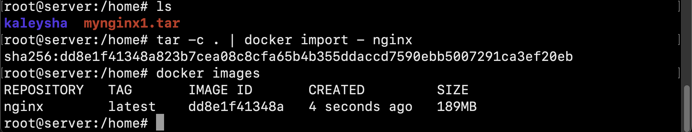

## Part 1. Ready-made docker

##### 1) Take the official docker image from nginx and download it using docker pull

##### 2) Check for the docker image with docker images.

##### 3) Run docker image with docker run -d [image_id|repository].

##### 4) Check that the image is running with docker ps.

##### 5) View container information with docker inspect [container_id|container_name].

##### 6) From the command output define and write in the report the container size, list of mapped ports and container ip.

##### 7) Stop docker image with docker stop [container_id|container_name].

##### 8) Check that the image has stopped with docker ps.

##### 9) Run docker with ports 80 and 443 in container, mapped to the same ports on the local machine, with run command.

##### 10) Check that the nginx start page is available in the browser at localhost:80.

##### 11) Restart docker container with docker restart [container_id|container_name].
##### 12) Check in any way that the container is running.

## Part 2. Operations with container

##### 1) Read the  _nginx.conf_  configuration file inside the docker container with the  _exec_  command.

##### 2) Create a  _nginx.conf_  file on a local machine.
##### 3) Configure it on the  _/status_  path to return the  **nginx**  server status page.

##### 4) Copy the created  _nginx.conf_  file inside the docker image using the  `docker cp`  command.

##### 5) Restart **nginx**  inside the docker image with  _exec_.

##### 6) Check that  _localhost:80/status_  returns the  **nginx**  server status page.

##### 7) Export the container to a  _container.tar_  file with the  _export_  command.

##### 8) Stop the container.

##### 9) Delete the image with  `docker rmi [image_id|repository]`without removing the container first.

##### 10) Delete stopped container.

##### 11) Import the container back using the  _import_command.

##### 12) Run the imported container.

##### 13) Check that  _localhost:80/status_  returns the  **nginx**  server status page.

