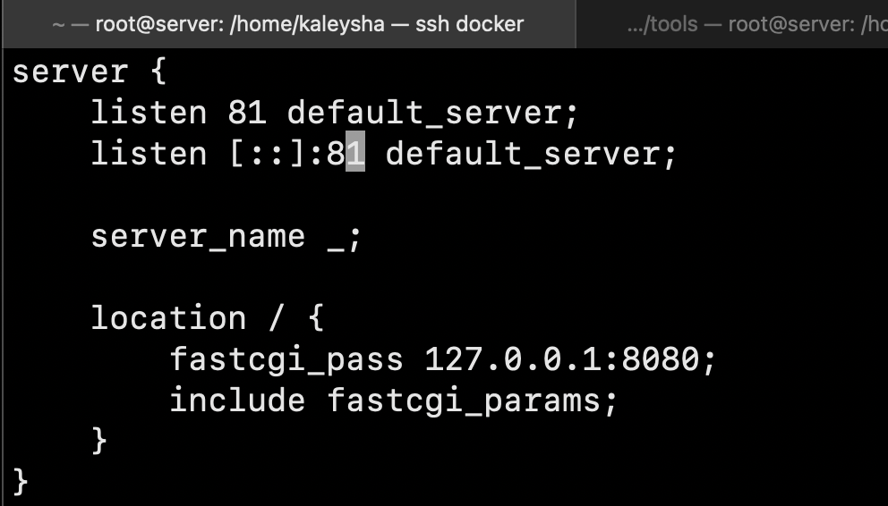
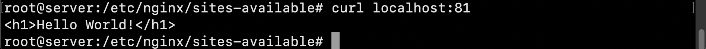
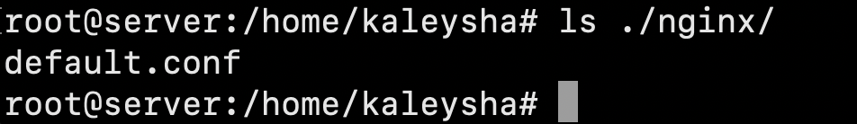
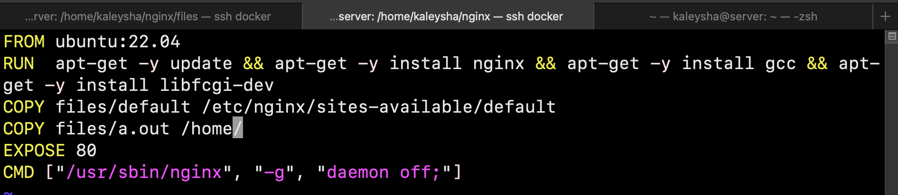
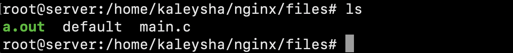
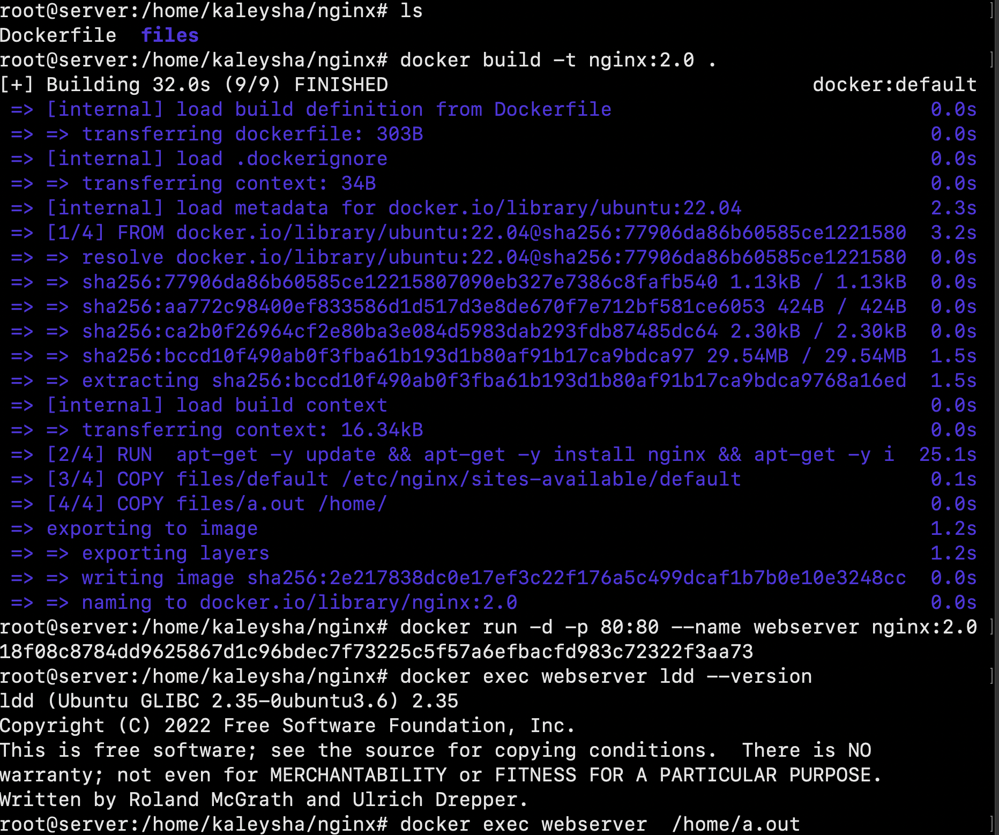
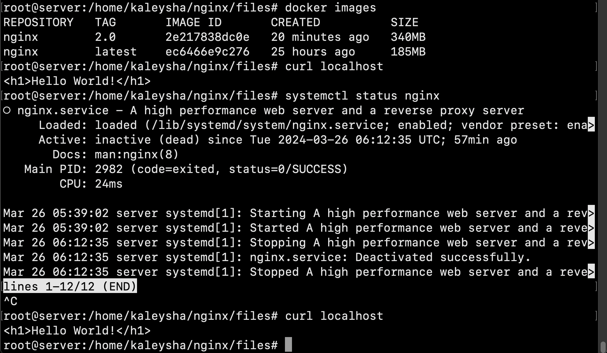
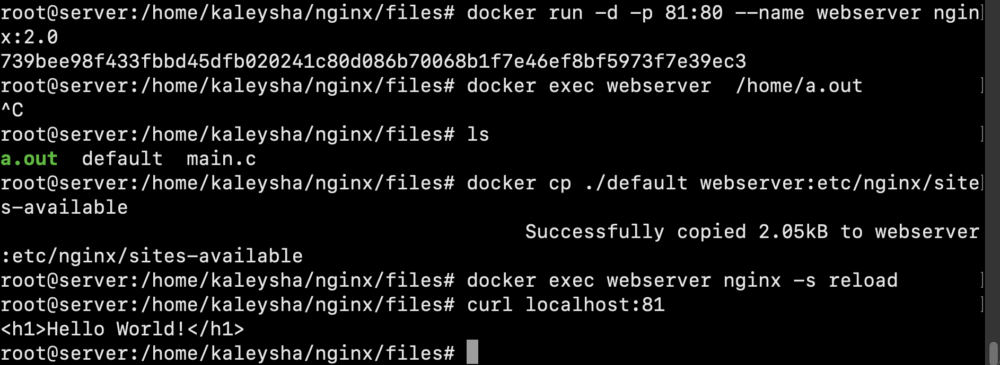

## Part 3. Mini web server

##### 1) Write a mini server in C and FastCgi that will return a simple page saying Hello World!.
##### 2) Run the written mini server on port 8080.
##### 3) Write your own nginx.conf that will proxy all requests from port 81 to 127.0.0.1:8080.
##### 4) Check that browser on localhost:81 returns the page you wrote.

##### 5) Put the nginx.conf file under ./nginx/nginx.conf.

## Part 4. Your own docker

